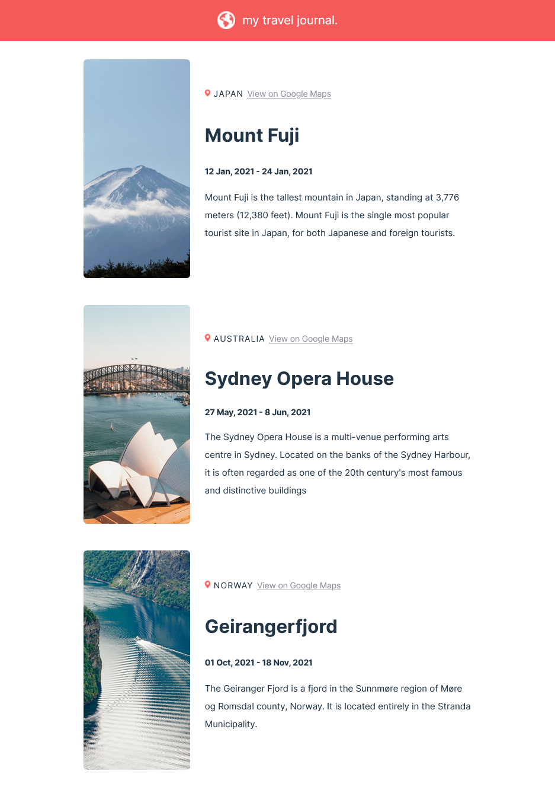

# Travel Blog -A React app

## Table of contents

- [Overview](#overview)
  - [The challenge](#the-challenge)
  - [Screenshot](#screenshot)
- [My process](#my-process)
  - [Built with](#built-with)
- [Author](#author)

## Overview

This is a solution to the Solo Project provided by Scrimba. The design was provided by the platform, the solution is however entierly my own. This was an excercise to solidify my React basics :)

### The challenge

Users should be able to:

- View the optimal layout for the site depending on their device's screen size
- Check the location of the place viseted on Google Maps

### Screenshot

## My process

### Built with

- Semantic HTML5 markup
- CSS custom properties
- CSS Grid

## Author

- Twitter - [@SaraGadAlMawla](https://twitter.com/SaraGadAlMawla)
